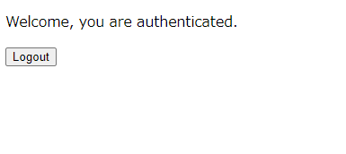

# Web sample
Web開発で最低限必要なフロントエンド、バックエンド、DBの構築をセットにしたサンプルコードです。

## 説明
- webアプリ開発を素早く開始できることを目的としています。
- バックエンドは様々な言語で用意していきます。（随時更新予定）
- 作成者はすべての言語に精通しているわけではありません。9割以上がAIで生成しているソースもあります。
- セキュリティ面は考慮していません。実際の開発では考慮してください。
- フレームワークの選定に深い理由はありません。
- テストコードもそのうち追加したいという気持ちはあります。
- サンプルの充実に協力してくれる方は常にウェルカムです。

## フォルダ構成
```
web_sample
    ├─ db  # DB用のファイル（現状はPostgreSQL）
    ├─ view-app  # フロント用のソース
    |  #以下、バックエンド用のソース
    ├─ node-app  # Node.jsソース
    ├─ python-app  # pythonソース
    ├─ perl-app # perlソース
    ├─ php-app # phpソース
    |
    ├─ # coming soon…
```

- バックエンド用のソースは、compose.yamlを編集し、使いたい言語のapi-appのコメントアウトを外す

## 構築手順
- dockerインストール(Ubuntuの例)
    - [公式](https://docs.docker.com/engine/install/)より抜粋
```bash
# Add Docker's official GPG key:
sudo apt-get update
sudo apt-get install ca-certificates curl
sudo install -m 0755 -d /etc/apt/keyrings
sudo curl -fsSL https://download.docker.com/linux/ubuntu/gpg -o /etc/apt/keyrings/docker.asc
sudo chmod a+r /etc/apt/keyrings/docker.asc

# Add the repository to Apt sources:
echo \
  "deb [arch=$(dpkg --print-architecture) signed-by=/etc/apt/keyrings/docker.asc] https://download.docker.com/linux/ubuntu \
  $(. /etc/os-release && echo "$VERSION_CODENAME") stable" | \
  sudo tee /etc/apt/sources.list.d/docker.list > /dev/null
sudo apt-get update
sudo apt-get install docker-ce docker-ce-cli containerd.io docker-buildx-plugin docker-compose-plugin

# Setting to omit sudo:
sudo groupadd docker
sudo usermod -aG docker $USER
newgrp docker
```

- 起動
```bash
docker compose up -d --build
# --buildは初回だけでよい(Dockerfileを修正した場合も指定が必要)
```

- 停止
```bash
docker compose down
# DBを初期化したい場合は以下(db/init-scripts以下に初期化処理を置く)
docker compose down -v
```

## Webページのアクセス方法
- http://localhost:8080/view/ にアクセスし、以下の情報でログインする
    - ユーザー：user
    - パスワード：password


- ログイン成功すると以下の画面が表示される



## DBの参照方法
- http://localhost:8080/db-manager/ にアクセスし、以下の情報でログインする(pgadmin 4)
    - ユーザー：admin@pgadmin.org
    - パスワード：admin


## その他
### Laravel環境用コマンド
- 環境構築
``` bash
# 以下をphp-appフォルダで実行
docker run --rm -v $(pwd):/app composer composer create-project --prefer-dist laravel/laravel .
```

- composer実行
``` bash
# 以下をphp-appフォルダで実行
docker run --rm -v $(pwd):/app composer composer ＜やりたいこと書く＞
```

- phpコマンド実行用
``` bash
# 以下をphp-appフォルダで実行
docker run --rm -v $(pwd):/app -w /app php:8.3-cli php artisan ＜やりたいこと書く＞
```

### nestjs環境用コマンド
- 環境構築
``` bash
# 以下をプロジェクトルートフォルダで実行
docker run -it --rm -v ${PWD}:/app -w /app node:22-alpine sh -c "
  apk add --no-cache git &&
  npm install -g @nestjs/cli &&
  nest new nestjs-app --skip-install &&
  cd nestjs-app &&
  npm install
"
cd nestjs-app
rm -r .git
```

- npm実行
``` bash
# 以下をnestjs-appフォルダで実行
docker run -it --rm -v ${PWD}:/app -w /app node:22-alpine sh -c "＜やりたいこと書く＞"
```

### 既知の不具合
- docker compose立ち上げ時に、networkにサービスが登録されないことがある。（docker network inspect見ると登録されていない）  
原因不明だが、再度立ち上げれば直る。
